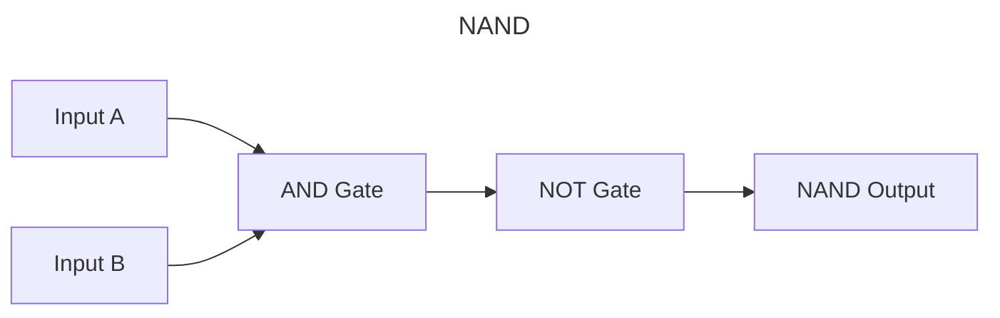
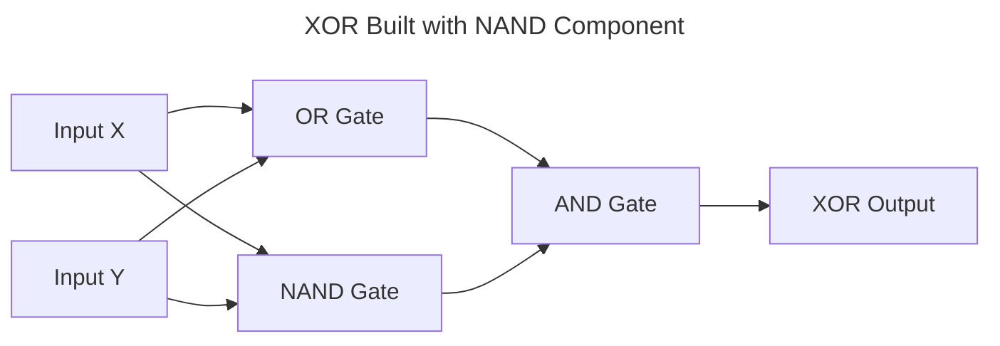

# Circuit Builder Assignment

## Overview

In this assignment, you will build an interactive web application for creating and simulating digital logic circuits. You will implement circuit creation using logic gates, enable reusable components, and develop circuit evaluation functionality.

The API provides AND, OR, and NOT gates as primitives. Complex gates (like NAND, XOR) can be built by compositing circuits from these basic gates.

**NAND Gate Circuit:**



**XOR Using NAND Component:**



_Project skeleton and boilerplate provided. Core implementation to be completed by developer._

> [!IMPORTANT]
> **Getting Started:** Use this repository as a template to create your own assignment repository before beginning development.

## Quick Start

### Prerequisites

- Go 1.21+, Flutter 3.8.1+
- Task runner: [Installation guide](https://taskfile.dev/installation/)

### Setup

```bash
# Backend
cd backend && task dev  # :8080

# Frontend
cd frontend && task dev  # Opens in Chrome
```

## Assignment Requirements

### Core Features to Implement

> [!WARNING]
> **Backend Requirements:**
> 
> 1. **Circuit Evaluation Engine** - Boolean logic evaluation algorithm
> 2. **Service Layer Implementation** - Implement business logic in provided service interfaces
> 3. **Database Integration** - Add persistence layer
> 4. **GraphQL Resolvers** - Complete resolver implementations for all schema operations
> 5. **Validation & Error Handling** - Circuit validation and proper error responses

> [!WARNING]
> **Frontend Requirements:**
> 
> 1. **Circuit Editor UI** - Canvas-based drag-and-drop interface (primary challenge)
> 2. **Component Palette** - Draggable logic gates (AND, OR, NOT) and I/O nodes
> 3. **GraphQL Integration** - Wire up mutations for circuit creation/editing
> 4. **Circuit Visualization** - Real-time circuit display and connection visualization
> 5. **Circuit Simulation** - Interface for inputting values and displaying outputs

**Optional Enhancements:**

- **Circuits in Component Palette** - Save and reuse circuits as custom components
- **Signal Flow Visualization** - Animate input-to-output data flow through circuit
- **Comprehensive Test Suite** - Unit/integration tests for both frontend and backend
- **Auto-Layout Algorithms** - Automatic circuit arrangement (force-directed, hierarchical, etc.)
- **Undo/Redo System** - Full action history with state management
- **Creative Extensions** - Any additional features that demonstrate your technical skills

## Implementation Approach

**Backend Choice:**

- **Recommended**: Use provided Go GraphQL skeleton for rapid development
- **Alternative**: Implement with your preferred backend language/transport layer

**Frontend Requirement:**
Flutter web frontend is required. The provided skeleton includes Ferry GraphQL client setup.

> [!IMPORTANT]
> **Implementation Guidelines:**
> 
> - **Use Standard Libraries** - Prefer built-in language features and standard libraries over external dependencies
> - **Showcase Your Skills** - Avoid third-party packages that would solve core challenges (circuit evaluation, UI interactions)
> - **Flutter Widgets** - Leverage advanced widgets like `CustomPainter`, `MultiChildRenderObject` for custom UI
> - **Dependencies Only for Infrastructure** - External packages acceptable for database drivers, HTTP clients, basic utilities

## Submission

- Create a template from this repository
- Version control your assignment on **GitHub**
- Give access to [@rlch](https://github.com/rlch)
- Send repository link, time taken, and brief video overview to: `sonny@tutero.com.au`, `richard@tutero.com.au`

## Documentation

- [backend/README.md](backend/README.md) - Backend development guide
- [frontend/README.md](frontend/README.md) - Frontend development guide

## References

- [Logic Gates](https://en.wikipedia.org/wiki/Logic_gate) - Boolean logic fundamentals
- [gqlgen Documentation](https://gqlgen.com/) - GraphQL server generation
- [GraphQL Specification](https://spec.graphql.org/) - API standard
- [Ferry GraphQL Client](https://ferrygraphql.com/) - Flutter GraphQL client
